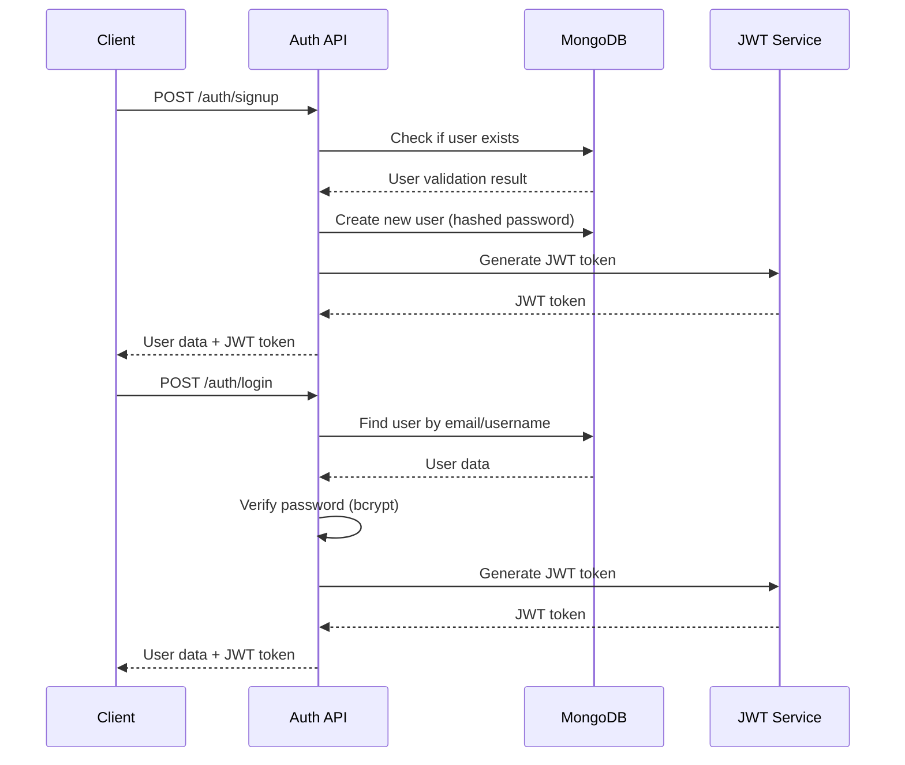
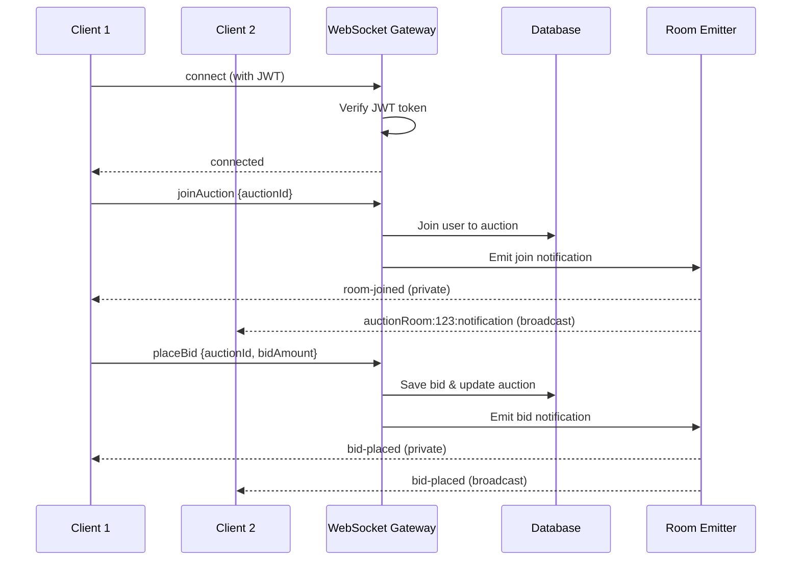

# 👑 Royal Class Assignment - Real-Time Auction System

A comprehensive NestJS backend application featuring real-time auction management with WebSocket support, JWT authentication, and automated auction lifecycle management.

## 🌟 Features

- **🔐 JWT Authentication** - Secure user authentication and authorization
- **🏠 Real-Time Auction Rooms** - WebSocket-powered live bidding
- **⚡ Live Bidding System** - Real-time bid placement and updates
- **🔄 Automated Auction Management** - Cron jobs for auction lifecycle
- **📊 Comprehensive APIs** - RESTful endpoints for all operations
- **🛡️ Security Guards** - Both HTTP and WebSocket authentication
- **📚 MongoDB Integration** - Robust data persistence with Mongoose
- **🎯 Modular Architecture** - Clean, scalable code structure

## 🏗️ Architecture Overview

```
┌─────────────────┐    ┌─────────────────┐    ┌─────────────────┐
│   Frontend      │    │   WebSocket     │    │   HTTP APIs     │
│   Clients       │◄──►│   Gateway       │◄──►│   Controllers   │
└─────────────────┘    └─────────────────┘    └─────────────────┘
                                ▲                        ▲
                                │                        │
                       ┌─────────────────┐    ┌─────────────────┐
                       │   Room Emitter  │    │   Services      │
                       │   (Events)      │    │   (Business)    │
                       └─────────────────┘    └─────────────────┘
                                ▲                        ▲
                                │                        │
                       ┌─────────────────┐    ┌─────────────────┐
                       │   Cron Jobs     │    │   Database      │
                       │   (Automation)  │◄──►│   (MongoDB)     │
                       └─────────────────┘    └─────────────────┘
```

## 📁 Project Structure

```
src/
├── 🔐 auth/                     # Authentication Module
│   ├── auth.controller.ts       # Login, Signup, User Data endpoints
│   ├── auth.module.ts          # Module configuration
│   ├── dto/                    # Data Transfer Objects
│   └── services/               # Authentication business logic
├── 🏛️ auction/                  # Auction Management Module
│   ├── auction.controller.ts   # Create & List auctions
│   ├── auction.module.ts       # Module configuration
│   ├── dto/                    # Auction DTOs
│   └── services/               # Auction business logic
├── 💰 bids/                     # Bidding System Module
│   ├── bids.controller.ts      # Bid management endpoints
│   ├── bids.module.ts          # Module configuration
│   ├── dto/                    # Bid DTOs
│   └── services/               # Bidding business logic
├── 🌐 websocket/                # Real-Time Communication
│   ├── controllers/            # WebSocket event handlers
│   ├── emitters/               # Event emission utilities
│   ├── gateways/               # WebSocket gateway setup
│   └── services/               # WebSocket helpers
├── ⚙️ common/                   # Shared Utilities
│   ├── guards/                 # Authentication guards
│   ├── schemas/                # Database schemas
│   ├── constants/              # Application constants
│   ├── errors/                 # Error handling
│   └── helper/                 # Utility functions
├── ⏰ cron-jobs/                # Automated Tasks
│   └── auction/                # Auction lifecycle automation
└── 🚀 main.ts                   # Application entry point
```

## 🛠️ Installation & Setup

### Prerequisites
- **Node.js** (v16 or higher)
- **MongoDB** (v4.4 or higher)
- **npm** or **yarn**

### Quick Start

```bash
# 1. Clone the repository
git clone <repository-url>
cd royal-class-assignment

# 2. Install dependencies
npm install

# 3. Set up environment variables
.env
# Edit .env with your configuration

# 4. Start the application
npm run start:dev
```

### Environment Variables

Create a `.env` file in the root directory:

```env
# Database Configuration
MONGODB_URI=mongodb://localhost:27017/royal_auction

# JWT Configuration
JWT_SECRET=your-super-secret-jwt-key-here

# Server Configuration
PORT=4000

# Redis Configuration (Optional)
REDIS_URL=redis://localhost:6379
```

## 🔐 Authentication System

### User Registration & Login Flow



## 🌐 HTTP API Endpoints

### 🔐 Authentication Endpoints

#### `POST /auth/signup`
Register a new user account.

**Request Body:**
```json
{
  "name": "John Doe",
  "username": "johndoe",
  "email": "john@example.com",
  "password": "SecurePass123"
}
```

**Response:**
```json
{
  "data": {
    "_id": "user_id",
    "username": "johndoe",
    "name": "John Doe",
    "email": "john@example.com"
  },
  "token": "eyJhbGciOiJIUzI1NiIsInR5cCI6IkpXVCJ9...",
  "meta": {
    "code": 200,
    "message": "User registered successfully"
  }
}
```

#### `POST /auth/login`
Authenticate user and get JWT token.

**Request Body:**
```json
{
  "usernameOrEmail": "johndoe",
  "password": "SecurePass123"
}
```

**Response:**
```json
{
  "data": {
    "_id": "user_id",
    "username": "johndoe",
    "name": "John Doe",
    "email": "john@example.com"
  },
  "token": "eyJhbGciOiJIUzI1NiIsInR5cCI6IkpXVCJ9...",
  "meta": {
    "code": 200,
    "message": "Login successful"
  }
}
```

#### `GET /auth/getuserdata`
Get authenticated user's data and active auctions.

**Headers:**
```
Authorization: Bearer <jwt_token>
```

**Response:**
```json
{
  "data": {
    "_id": "user_id",
    "username": "johndoe",
    "name": "John Doe",
    "email": "john@example.com",
    "activeAuctions": ["auction_id_1", "auction_id_2"]
  },
  "meta": {
    "code": 200,
    "message": "User data retrieved successfully"
  }
}
```

### 🏛️ Auction Endpoints

#### `POST /auction/create`
Create a new auction (requires authentication).

**Headers:**
```
Authorization: Bearer <jwt_token>
```

**Request Body:**
```json
{
  "title": "Luxury Car Auction",
  "carId": "car_object_id",
  "startTime": "2024-01-15T10:00:00Z",
  "endTime": "2024-01-15T18:00:00Z",
  "startingBid": 50000
}
```

**Response:**
```json
{
  "data": {
    "_id": "auction_id",
    "title": "Luxury Car Auction",
    "startTime": "2024-01-15T10:00:00Z",
    "endTime": "2024-01-15T18:00:00Z",
    "startingBid": 50000,
    "currentHighestBid": 50000,
    "status": "active",
    "participants": [],
    "allParticipants": []
  },
  "meta": {
    "code": 200,
    "message": "Auction created successfully"
  }
}
```

#### `GET /auction/active`
Get list of active auctions with pagination.

**Query Parameters:**
- `page` (optional): Page number (default: 1)
- `limit` (optional): Items per page (default: 10)
- `status` (optional): Filter by status
- `search` (optional): Search in auction titles

**Response:**
```json
{
  "data": {
    "auctions": [
      {
        "_id": "auction_id",
        "title": "Luxury Car Auction",
        "startingBid": 50000,
        "currentHighestBid": 75000,
        "status": "active",
        "participantCount": 5
      }
    ],
    "pagination": {
      "page": 1,
      "limit": 10,
      "total": 25,
      "totalPages": 3,
      "hasNext": true,
      "hasPrev": false
    }
  },
  "meta": {
    "code": 200,
    "message": "Auctions fetched successfully"
  }
}
```

### 💰 Bidding Endpoints

#### `GET /bids/auction/:auctionId`
Get all bids for a specific auction (requires authentication).

**Headers:**
```
Authorization: Bearer <jwt_token>
```

**Response:**
```json
{
  "data": [
    {
      "_id": "bid_id",
      "bidAmount": 75000,
      "userId": "user_id",
      "auctionId": "auction_id",
      "createdAt": "2024-01-15T12:30:00Z"
    }
  ],
  "meta": {
    "code": 200,
    "message": "Bids retrieved successfully"
  }
}
```

#### `GET /bids/my-bids`
Get current user's bids (requires authentication).

**Headers:**
```
Authorization: Bearer <jwt_token>
```

**Response:**
```json
{
  "data": [
    {
      "_id": "bid_id",
      "bidAmount": 75000,
      "auctionId": "auction_id",
      "createdAt": "2024-01-15T12:30:00Z"
    }
  ],
  "meta": {
    "code": 200,
    "message": "User bids retrieved successfully"
  }
}
```

## 🔌 WebSocket Real-Time System

### Connection Setup

```javascript
import { io } from 'socket.io-client';

// Connect to the auction room namespace
const socket = io('http://localhost:3000/royalClassAuctionRoom', {
  transports: ['websocket'],
  auth: {
    token: 'your-jwt-token-here'
  }
});
```

### WebSocket Event Flow



### 📡 WebSocket Events

#### 🔗 Connection Events

**Client → Server: Connection**
```javascript
// Automatic on connection with JWT token in auth
socket.on('connect', () => {
  console.log('Connected to auction server');
});

socket.on('connect_error', (error) => {
  console.log('Connection failed:', error.message);
});
```

#### 🏠 Room Management Events

**Client → Server: Join Auction**
```javascript
socket.emit('joinAuction', {
  auctionId: 'auction_object_id'
});
```

**Server → Client: Room Joined (Private Response)**
```javascript
socket.on('room-joined', (data) => {
  console.log('Successfully joined auction:', data);
  // data contains full auction details and bid history
});
```

**Server → All Clients: Join Notification (Broadcast)**
```javascript
socket.on('auctionRoom:AUCTION_ID:notification', (data) => {
  console.log('Room notification:', data.notification);
  // Example: "John Doe joined the auction."
});
```

#### 💰 Bidding Events

**Client → Server: Place Bid**
```javascript
socket.emit('placeBid', {
  auctionId: 'auction_object_id',
  bidAmount: 75000
});
```

**Server → Client: Bid Placed (Private Response)**
```javascript
socket.on('bid-placed', (data) => {
  console.log('Your bid placed successfully:', data);
  /*
  {
    message: "Bid placed successfully",
    bid: {
      _id: "bid_id",
      bidAmount: 75000,
      userId: "user_id",
      auctionId: "auction_id"
    }
  }
  */
});
```

**Server → All Clients: New Bid (Broadcast)**
```javascript
socket.on('bid-placed', (data) => {
  console.log('New bid in auction:', data);
  /*
  {
    roomId: "auctionRoom:auction_id",
    bidAmount: 75000,
    bidder: "user_id",
    bidId: "bid_id",
    timestamp: "2024-01-15T12:30:00Z"
  }
  */
});
```

#### ❌ Error Events

**Server → Client: Room Join Error**
```javascript
socket.on('room-joined-error', (data) => {
  console.log('Failed to join room:', data.message);
});
```

**Server → Client: Bid Error**
```javascript
socket.on('bid-placed-error', (data) => {
  console.log('Bid failed:', data.message);
});
```

#### 🔄 Auction Lifecycle Events

**Server → All Clients: Auction Ended**
```javascript
socket.on('auctionEnd', (data) => {
  console.log('Auction ended:', data.notification);
});
```

**Server → Specific User: Personal Notification**
```javascript
socket.on('user:USER_ID', (data) => {
  console.log('Personal notification:', data.notification);
});
```

### 🎯 Complete WebSocket Integration Example

```html
<!DOCTYPE html>
<html>
<head>
    <title>Royal Auction WebSocket Client</title>
    <script src="https://cdn.socket.io/4.7.2/socket.io.min.js"></script>
</head>
<body>
    <div id="status">Disconnected</div>
    <div id="messages"></div>
    
    <input type="text" id="auctionId" placeholder="Auction ID" />
    <button onclick="joinAuction()">Join Auction</button>
    
    <input type="number" id="bidAmount" placeholder="Bid Amount" />
    <button onclick="placeBid()">Place Bid</button>

    <script>
        const token = 'your-jwt-token-here';
        let currentAuctionId = null;
        
        // Connect to auction room namespace
        const socket = io('http://localhost:3000/royalClassAuctionRoom', {
            transports: ['websocket'],
            auth: { token }
        });

        // Connection events
        socket.on('connect', () => {
            document.getElementById('status').textContent = 'Connected';
            log('Connected to auction server');
        });

        socket.on('disconnect', () => {
            document.getElementById('status').textContent = 'Disconnected';
            log('Disconnected from server');
        });

        socket.on('connect_error', (error) => {
            log('Connection error: ' + error.message);
        });

        // Room events
        socket.on('room-joined', (data) => {
            log('✅ Joined auction successfully');
            console.log('Auction data:', data);
        });

        socket.on('room-joined-error', (data) => {
            log('❌ Failed to join auction: ' + data.message);
        });

        // Bid events
        socket.on('bid-placed', (data) => {
            if (data.bid) {
                log('💰 Your bid placed: $' + data.bid.bidAmount);
            } else {
                log('💰 New bid: $' + data.bidAmount + ' by ' + data.bidder);
            }
        });

        socket.on('bid-placed-error', (data) => {
            log('❌ Bid failed: ' + data.message);
        });

        // Dynamic notification listener
        function listenForAuctionNotifications(auctionId) {
            socket.on(`auctionRoom:${auctionId}:notification`, (data) => {
                log('📢 ' + data.notification);
            });
        }

        // Auction lifecycle events
        socket.on('auctionEnd', (data) => {
            log('🏁 ' + data.notification);
        });

        // Functions
        function joinAuction() {
            const auctionId = document.getElementById('auctionId').value;
            if (!auctionId) {
                alert('Please enter auction ID');
                return;
            }
            
            currentAuctionId = auctionId;
            listenForAuctionNotifications(auctionId);
            socket.emit('joinAuction', { auctionId });
        }

        function placeBid() {
            if (!currentAuctionId) {
                alert('Please join an auction first');
                return;
            }
            
            const bidAmount = parseFloat(document.getElementById('bidAmount').value);
            if (!bidAmount || bidAmount <= 0) {
                alert('Please enter valid bid amount');
                return;
            }
            
            socket.emit('placeBid', {
                auctionId: currentAuctionId,
                bidAmount: bidAmount
            });
        }

        function log(message) {
            const messages = document.getElementById('messages');
            const timestamp = new Date().toLocaleTimeString();
            messages.innerHTML += `<div>[${timestamp}] ${message}</div>`;
            messages.scrollTop = messages.scrollHeight;
        }
    </script>
</body>
</html>
```

## ⏰ Automated Auction Management

### Cron Job System

The system includes automated auction lifecycle management:

```typescript
// Runs every minute to check auction status
@Cron('0 * * * * *')
async auctionCron() {
  // 1. Save active auctions to Redis cache
  await this.saveActiveAuctionsToRedis();
  
  // 2. Check for ended auctions and announce winners
  await this.triggerAuctionResultAnnouncement();
}
```

**Automated Features:**
- ✅ **Active Auction Tracking** - Monitors auction start/end times
- ✅ **Winner Announcement** - Automatically determines auction winners
- ✅ **Real-time Notifications** - Sends WebSocket notifications for auction events
- ✅ **Redis Caching** - Caches active auction data for performance

## 📊 Database Schemas

### 👤 User Schema
```typescript
{
  name: string;           // User's full name
  username: string;       // Unique username
  email: string;          // Unique email address
  password: string;       // Hashed password (bcrypt)
  balance: number;        // User's account balance (default: 10000)
  createdAt: Date;        // Auto-generated
  updatedAt: Date;        // Auto-generated
}
```

### 🏛️ Auction Schema
```typescript
{
  carId: ObjectId;              // Optional car reference
  title: string;                // Auction title
  startTime: Date;              // Auction start time
  endTime: Date;                // Auction end time
  startingBid: number;          // Starting bid amount
  currentHighestBid: number;    // Current highest bid
  winnerId: ObjectId;           // Winner user ID (ref: User)
  bidId: ObjectId;              // Winning bid ID (ref: Bid)
  status: 'active' | 'inactive' | 'completed';
  participants: ObjectId[];     // Current active participants
  allParticipants: ObjectId[];  // All users who ever participated
  createdAt: Date;              // Auto-generated
  updatedAt: Date;              // Auto-generated
}
```

### 💰 Bids Schema
```typescript
{
  bidAmount: number;        // Bid amount
  win: boolean;            // Whether this bid won (default: false)
  userId: ObjectId;        // Bidder user ID (ref: User)
  auctionId: ObjectId;     // Auction ID (ref: Auction)
  createdAt: Date;         // Auto-generated
  updatedAt: Date;         // Auto-generated
}
```

## 🛡️ Security Features

### Authentication & Authorization
- **JWT Tokens** - Secure token-based authentication
- **HTTP Guards** - Protect REST API endpoints
- **WebSocket Guards** - Secure real-time connections
- **Password Hashing** - bcrypt with salt rounds
- **CORS Protection** - Configurable cross-origin policies

### Request Validation
- **DTO Validation** - class-validator for request validation
- **Type Safety** - TypeScript for compile-time safety
- **Error Handling** - Centralized error management

## 🚀 Running the Application

### Development Mode
```bash
# Start with hot reload
npm run start:dev

# Watch for file changes
npm run start:dev --watch
```

### Production Mode
```bash
# Build the application
npm run build

# Start production server
npm run start:prod
```

### Testing
```bash
# Run unit tests
npm run test

# Run e2e tests
npm run test:e2e

# Test coverage
npm run test:cov
```

## 📈 Performance Features

- **Redis Caching** - Active auction data caching
- **Database Indexing** - Optimized MongoDB queries
- **Connection Pooling** - Efficient database connections
- **Real-time Updates** - Minimal latency WebSocket events

## 🔧 Configuration

### Environment Variables
```env
# Required
MONGODB_URI=mongodb://localhost:27017/royal_auction
JWT_SECRET=your-secret-key

# Optional
PORT=3000
REDIS_URL=redis://localhost:6379
NODE_ENV=development
```

### CORS Configuration
```typescript
app.enableCors({
  origin: true, // Configure for production
  methods: ['GET', 'POST', 'PUT', 'DELETE', 'PATCH', 'OPTIONS'],
  allowedHeaders: ['Content-Type', 'Authorization', 'Accept'],
  credentials: true,
});
```

## 📝 API Response Format

All API responses follow a consistent format:

```json
{
  "data": {}, // Response data
  "meta": {
    "code": 200,
    "message": "Success message"
  },
  "token": "..." // Only for login responses
}
```

## 🤝 Contributing

1. Fork the repository
2. Create a feature branch (`git checkout -b feature/amazing-feature`)
3. Commit your changes (`git commit -m 'Add amazing feature'`)
4. Push to the branch (`git push origin feature/amazing-feature`)
5. Open a Pull Request

## 📄 License

This project is licensed under the MIT License - see the [LICENSE](LICENSE) file for details.

---

## 🎯 Quick Test Guide

### 1. Test Authentication
```bash
# Register a user
curl -X POST http://localhost:3000/auth/signup \
  -H "Content-Type: application/json" \
  -d '{"name":"John Doe","username":"johndoe","email":"john@example.com","password":"SecurePass123"}'

# Login
curl -X POST http://localhost:3000/auth/login \
  -H "Content-Type: application/json" \
  -d '{"usernameOrEmail":"johndoe","password":"SecurePass123"}'
```

### 2. Test WebSocket Connection
Use the provided `test.html` file or create your own WebSocket client to test real-time features.

### 3. Create and Join Auctions
1. Create an auction via HTTP API
2. Connect to WebSocket with JWT token
3. Join the auction room
4. Place bids and see real-time updates

---

**Built with ❤️ using NestJS, MongoDB, Socket.IO, and TypeScript**